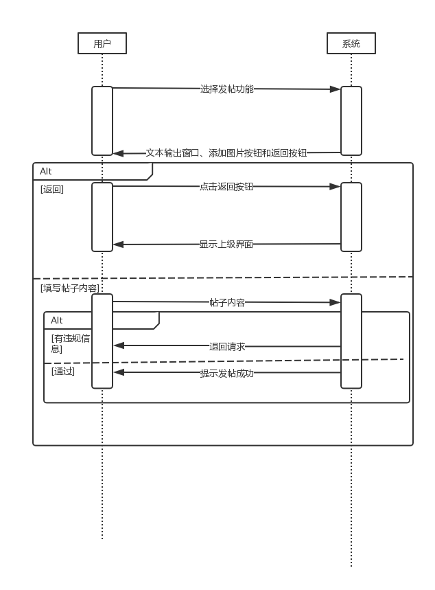

# WildLilyBBS分析模型文档

## 目录

[TOC]

## 更新记录

| 日期      | 更新者 | 版本号 | 更新内容 |
| --------- | ------ | ------ | -------- |
| 2018.11.8 | 乔鑫   | 0.0.1  | 基本框架 |
|           |        |        |          |

## 1.概念类图

## 2.用例图

## 3.详细用例说明

### 3.1 用户管理个人信息

#### 3.1.1 活动图

#### 3.1.2 顺序图

#### 3.1.3 状态图

### 3.2 用户看贴

#### 3.2.1 活动图

#### 3.2.2 顺序图

#### 3.2.3 状态图

### 3.3 用户发帖

#### 3.3.1 活动图

#### 3.3.2 顺序图

#### 3.3.3 状态图

### 3.4 用户回帖

#### 3.4.1 活动图

#### 3.4.2 顺序图

#### 3.4.3 状态图

### 3.5 删帖

#### 3.5.1 活动图

#### 3.5.2 顺序图

#### 3.5.3 状态图

### 3.6 收发消息

#### 3.6.1 活动图

#### 3.6.2 顺序图

#### 3.6.3 状态图

略

### 3.7 管理员管理用户

#### 3.7.1 活动图

#### 3.7.2 顺序图

#### 3.7.3 状态图

### 3.8 管理员管理板块

#### 3.8.1 活动图

#### 3.8.2 顺序图

#### 3.8.3 状态图

## 4.对象约束语言OCL

| 契约                                                         |
| ------------------------------------------------------------ |
| Context User::modifyMyInfo(info:UserInfo):UserInfo pre: User.isLoggedin()=true
post: User.info@pre=info |
| Context User::getMyPostList():List\<Post> pre: User.isLoggedin()=true |
| Context User::notInterestedIn(post:Post) pre: User.isLoggedin()=true and (ViewPost.type="home" or ViewPost.type="block") |
| Context User::post(post:Post) pre: User.isLoggedin()=true |
| Context User::reply(post:Post,originalPostId:int) pre: User.isLoggedin()=true and Post.exists(originalPostId)=true |
| Context User::delete(post:Post) pre: User.isLoggedin()=true |
| Context User::login(username:string,password:string) pre: User.getStatus(username)!="ban" and User.getStatus(username)!="del" |
| Cotext Block inv: Block.count<=Block.getDepartmentCount()+15 |
|                                                              |