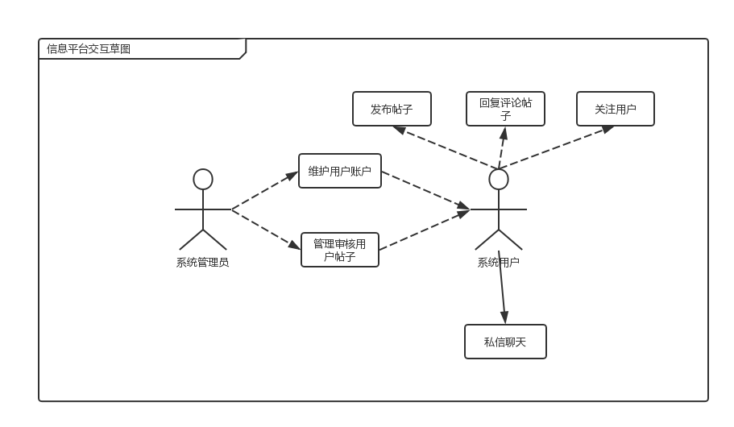

# 前景和范围文档

> 乔鑫，秦岭，秦天一，邱浩旻

## 目录

[TOC]

## 修订历史

| 人员                 | 版本   | 备注                 |
| -------------------- | ------ | -------------------- |
| 邱浩旻               | v0.0.1 | 新增过程文档初步框架 |
| 乔鑫，秦天一，邱浩旻 | v1.0.0 | 完成过程文档1.0.0    |

## 1. 业务需求

### 1.1 应用背景

南京大学小百合BBS是南京大学师生最常使用的一个半官方性质的BBS，始建于1997年，经历过关停和复用，现在已经有上亿次的访问记录。但在投入使用以来，小百合BBS的使用上存在着不方便的情况，也没有得到很好的解决。如发帖人和回帖人不能得到较为方便的交流方式，由于网站UI管理问题，虽然BBS有私信功能，但发帖人和回帖人不能较为方便及时地和对方进行交流；小百合BBS也推出过手机app，但由于不是官方管理和维护，无法达到其他交流平台的实时沟通功能。 

同时兴起的一个用于校内交流互动的方式是QQ空间衍生出的表白墙，是一个功能性的可管理的由学生投稿及时发布的小程序，表白墙由专人管理账户，统一接收由所有学生私信的投稿，并在收到后进行截图或文字转述发布到账户所在的空间，供所有关注的学生查看，但由于发送投稿过多，发送的信息无法通过分类发送，只有一个简单的时间线来查看历史信息，虽然有了以QQ整个大背景下实现的实时沟通交流，但一旦错过了某条与自己相关、或是感兴趣的信息，就需要花费极大的精力来找到投稿人的相关信息。 

结合两种校园较为正规官方的信息交流平台，结合两个平台分别存在的问题和两个平台持有的优势，同时发现最近的软件都提出了每个用户拥有相同APP却又有着不同的用户体验这一理念，决定设计一个能够提高获取信息效率同时也可以实现实时交互的软件，方便信息发布者和信息获取者的使用和体验，从而提高学生生活的质量。  

### 1.2 业务机遇

学生通过这一校内社交化交流平台，能保证每个使用者都在首页看到自己兴趣相关的内容，更方便地进行交流讨论，通过设置站内私信系统让有急迫需要的同学（如失物招领等）能够及时地进行联系。设置分类分板块，让使用者能够很方便地找到自己需要参与的信息板块，实现校内信息地高效流通。

### 1.3 业务目标与成功标准

#### 1.3.1 业务目标

- BR1:系统投入运营3个月后，个性化首页的推荐转化率达3%

  - 度量标准：转化率定义为用户在首页点击阅读的帖子数量与系统在首页给用户推荐的帖子数量之比，计算所有用户转化率的均值

  - 计量方法：检查系统的用户数据库中相应的各用户转化率，并取均值

  - 理想标准：达到3%；

    一般标准：达到2%；

    最低标准：达到1.25%

- BR2: 系统投入运营3个月后，除各院系自有的分区外，其他分区共不超过15个

  - 度量标准：系统数据库中板块的数量和板块名

  - 计量方法：检查系统系统数据库中板块的数量和板块名

  - 理想标准：除各院系自有的分区外，其他分区共不超过10个；

    一般标准：除各院系自有的分区外，其他分区共不超过12个；

    最低标准：除各院系自有的分区外，其他分区共不超过15个；

- BR3: 系统投入运营3个月后，各分区首页移动端转化率达5%

  - 度量标准：转化率定义为用户在分区首页阅读的帖子数量与系统在分区首页给用户推荐的帖子数量之比，计算所有用户转化率的均值

  - 计量方法：检查系统的用户数据库中相应的各用户转化率，并取均值

  - 理想标准：达到5%；

    一般标准：达到3.5%；

    最低标准：达到2%

- BR4: 系统投入运营3个月后，活跃用户数较小百合上升10%

  - 度量标准：统计最近一个月使用过系统功能的用户

  - 计量方法：查询用户数据库数据

  - 理想标准：上升15%；

    一般标准：上升10%；

    最低标准：上升5%

- BR5: 系统投入运营3个月后，用户在线时长较小百合上升10%

  - 度量标准：统计最近一个月所有用户在线时长之和

  - 计量方法：查询用户数据库数据

  - 理想标准：上升15%；

    一般标准：上升10%；

    最低标准：上升5%

- BR6: 系统投入运营3个月后，全站浏览量较小百合和表白墙的均值上升5%

  - 度量标准：统计最近一个月所有帖子浏览量之和

  - 计量方法：查询帖子数据库数据

  - 理想标准：上升6%；

    一般标准：上升5%；

    最低标准：上升3.5%

#### 1.3.2 成功标准

### 1.4 业务风险

## 2. 项目前景

### 2.1 前景概述

对校内的所有同学和老师来说，该系统是一个提供各种功能来方便使用者进行社交的一个方便快捷的信息平台。它能及时记录使用者的个人信息，自动对使用者的使用偏好和使用习惯进行记录，让每位使用者都有着属于自己的一个系统，该系统还对以往的历史数据进行分析和汇总，方便进行流量的统计和信息的管控。同时，该信息平台在提供论坛式交流的同时，让每个使用者能够直接地和沟通对象进行联系，大大提高了信息的即时性。该信息平台在处理校内信息的同时，能极大提高信息传递质量和水平，能够吸引更多的校内的使用者。

### 2.2 主要特性

- SF1: 系统记录用户帖子浏览历史

- SF2: 系统记录用户不感兴趣的帖子

- SF3: 系统记录一周帖子浏览量

- SF4: 系统根据用户浏览情况生成用户偏好

- SF5: 系统根据用户偏好和帖子热度提供个性化推荐的首页

- SF6: 系统内置各院系板块和生活、求职、交友、二手市场、失物招领、校长信箱6个板块

- SF7: 系统允许管理员在不超过板块上限的情况下可根据用户反馈增辟板块

- SF8: 系统根据用户偏好和帖子热度提供个性化板块主页 

- SF9: 系统采用Material Design风格

- SF10: 系统提供Web、iOS和Android三平台应用

- SF11: 系统实现即时通讯功能

### 2.3 假设与依赖

#### 2.3.1 假设

- AS-1：在现阶段，校内人数不会有太大变化。
- AS-2：用户有可以连接 Internet 的网络和相关知识。
- AS-3：用户的数量规模有一个最大上限，最大信息存储空间一定。 
- AS-4：大部分用户在本意上还是愿意帮助提供反馈。 

#### 2.3.2 依赖

- DE-1：发帖相关内容需遵守有关法律。

## 3. 项目范围

### 3.1 范围列表

| 特性                                                         | 版本1         | 版本2    | 版本3 |
| ------------------------------------------------------------ | ------------- | -------- | ----- |
| SF1: 系统记录用户帖子浏览历史                                | 完整实现      |          |       |
| SF2: 系统记录用户不感兴趣的帖子                              |               | 完整实现 |       |
| SF3: 系统记录一周帖子浏览量                                  | 完整实现      |          |       |
| SF4: 系统根据用户浏览情况生成用户偏好                        |               |          |       |
| SF5: 系统根据用户偏好和帖子热度提供个性化推荐的首页          |               |          |       |
| SF6: 系统内置各院系板块和生活、求职、交友、二手市场、失物招领、校长信箱6个板块 | 完整实现      |          |       |
| SF7: 系统允许管理员在不超过板块上限的情况下可根据用户反馈增辟板块 | 完整实现      |          |       |
| SF8: 系统根据用户偏好和帖子热度提供个性化板块主页            |               |          |       |
| SF9: 系统采用Material Design风格                             |               |          |       |
| SF10: 系统提供Web、iOS和Android三平台应用                    | 提供Web端应用 |          |       |
| SF11: 系统实现即时通讯功能                                   |               |          |       |

### 3.2 限制与排除

- LI-1：本系统是南京大学校内的信息交流平台，针对的是南京大学师生
- LI-2：本系统需要记录用户浏览帖子历史
- LI-3：本系统默认服务器搭建于互联网，使用系统需要互联网的支持，数据储存于服务器中

## 4. 项目环境

### 4.1 操作环境

#### 4.1.1 用户地理集中情况

所有用户都可以在任意可以接入互联网的地方使用该系统。

#### 4.1.2 各类用户使用系统时间状况

| 涉众   | 使用时间状况                       |
| ------ | ---------------------------------- |
| 用户   | 全天，下午到晚上为可能的高峰期时段 |
| 管理员 | 上班时间，以及突发性事件的出现时段 |

#### 4.1.3 数据生成与使用情况

| 数据类型       | 生成出处                                                   | 使用情况                                     |
| -------------- | ---------------------------------------------------------- | -------------------------------------------- |
| 用户偏好       | 主要从浏览记录、用户个人资料和用户不感兴趣的内容记录中提取 | 用于分析用户情况，对用户制定出个性化帖子推荐 |
| 用户反馈信息   | 可由用户直接向系统提交                                     | 用于管理员管理板块和统计满意度               |
| 帖子和评论信息 | 用户发帖、回帖、评论                                       | 供用户查看并利用                             |

### 4.2 涉众

#### 4.2.1 涉众的交互图

#### 4.2.2 涉众相关信息的具体说明

| 涉众       | 特征                                                         | 主要目标     | 态度 | 主要关注点                                 | 约束条件 |
| ---------- | ------------------------------------------------------------ | ------------ | ---- | ------------------------------------------ | -------- |
| 系统管理员 | 用户账号的维护管理、用户帖子的审核和管理                     | 维护社区环境 | 不明 | 方便且高效处理不良的帖子和违规的用户       | 无       |
| 系统用户   | 发表包含咨询，求助和交友内容的帖子，在帖子下方评论或回复评论，关注用户和私信聊天等 | 参与社区讨论 | 积极 | 方便地获取感兴趣的帖子，并且和其他用户交流 | 无       |

#### 4.2.3 与该软件系统直接相关的用户以及优先级评定

| 用户群体   | 任务                                     | 群体数量 | 优先级 |
| ---------- | ---------------------------------------- | -------- | ------ |
| 系统管理员 | 维护用户账户、管理生审核帖子             | 5        | 2      |
| 系统用户   | 发帖、回帖、回复评论、关注用户和私信聊天 | 10,000   | 1      |

### 4.3 项目属性

| 属性 | 执行者                                                       | 约束因素                                                     | 可调整因素                                                   |
| ---- | ------------------------------------------------------------ | ------------------------------------------------------------ | ------------------------------------------------------------ |
| 进度 |                                                              |                                                              | 计划在一个月内完成第一版，之后的两个月内完成第二版，可能的话再之后的两个月内完成第三版；在不包括任何评审的情况下，最多可超过期限的两个星期 |
| 特性 |                                                              | 第一版本中要求实现的特性必须完全可操作                       |                                                              |
| 质量 |                                                              | 必须通过 99%的用户验收检测；必须通过全部的安全性测试 （特别是用户个人信息） |                                                              |
| 人员 | 开发团队规模包括一名兼职项目经 理，一名需求工程师，一名开发人员 以及一名兼职测试人员；如果有必要还可以再增加兼职的开发人员 |                                                              |                                                              |
| 费用 |                                                              |                                                              | 在不包括责任人评审的情况下，财政预算最多可超支20%            |

