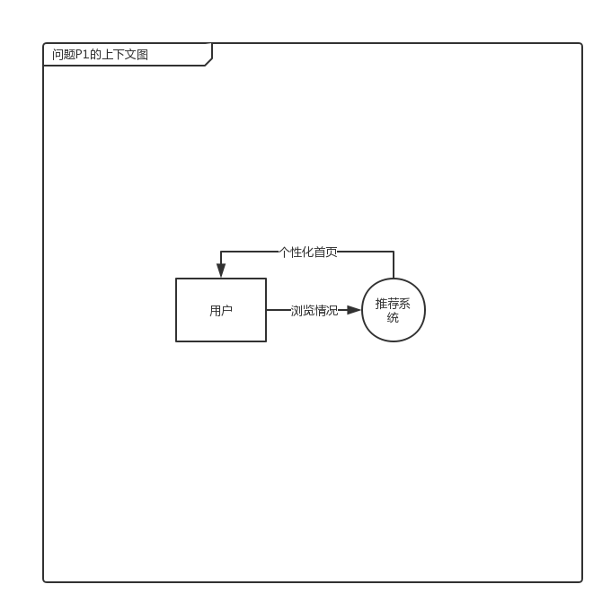
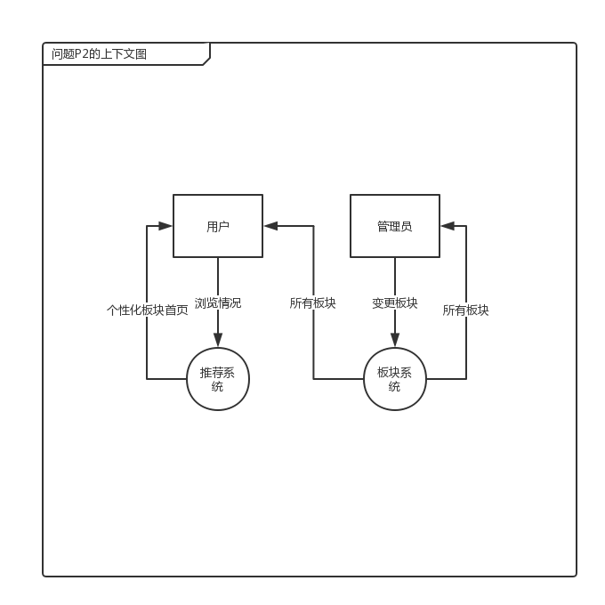
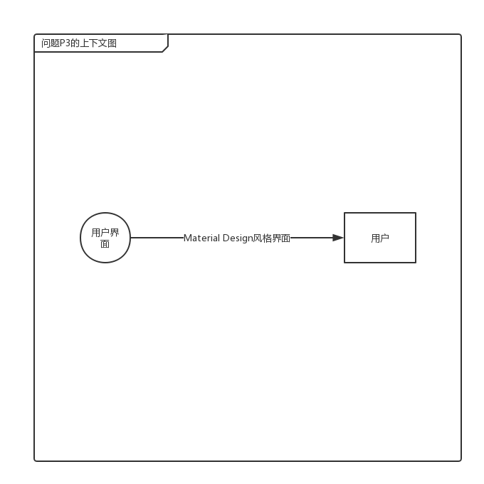
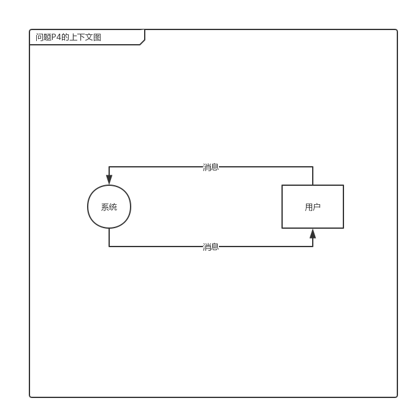
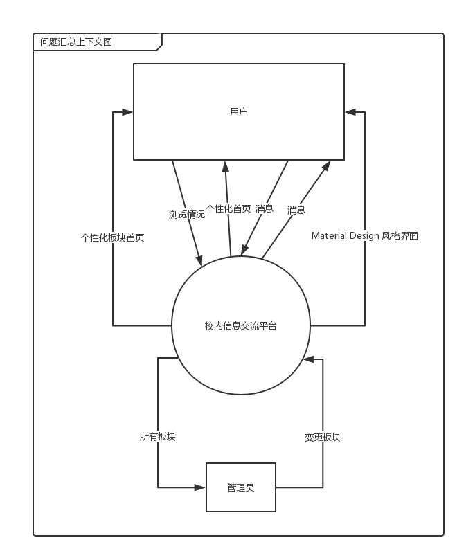
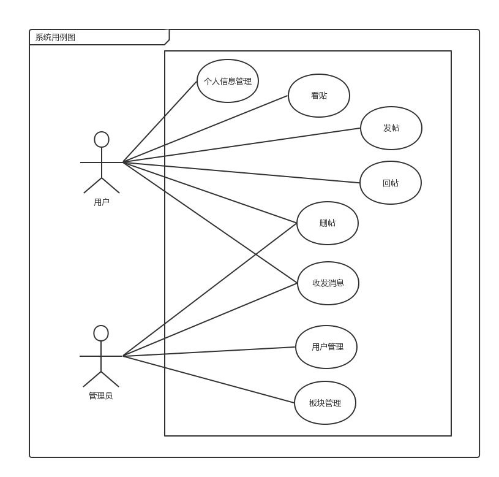

# 过程分析文档

> 乔鑫，秦岭，秦天一，邱浩旻

## 目录

[TOC]

## 修订历史

| 人员                       | 版本   | 备注                 |
| -------------------------- | ------ | -------------------- |
| 邱浩旻                     | v0.0.1 | 新增过程文档初步框架 |
| 乔鑫，秦天一，邱浩旻 | v1.0.0 |  完成过程文档1.0.0         |

## 1 问题分析

### 1.1 问题域资料

南京大学小百合BBS是南京大学师生最常使用的一个半官方性质的BBS，由于网站UI管理问题，虽然BBS有私信功能，但发帖人和回帖人不能较为方便及时地和对方进行交流；小百合BBS也推出过手机app，但由于不是官方管理和维护，无法达到其他交流平台的实时沟通功能。 同时兴起的一个用于校内交流互动的方式是QQ空间衍生出的表白墙，表白墙由专人管理账户，统一接收由所有学生私信的投稿，但由于发送投稿过多，发送的信息无法通过分类发送，只有一个简单的时间线来查看历史信息，虽然有了以QQ整个大背景下实现的实时沟通交流，但一旦错过了某条与自己相关、或是感兴趣的信息，就需要花费极大的精力来找到投稿人的相关信息。 希望有一个信息交流平台能够承接这两个使用较多平台的功能，同时达到软件实现千人千面的想法。 

当前，在小百合BBS和表白墙两个广泛使用的信息交流平台都有着不同的缺点和弊病，也有互相学习和借鉴的地方，同时都缺少用户的个性化推荐的实现。

### 1.2 涉众分析

| 涉众       | 特征                                                         | 主要目标     | 态度 | 主要关注点                                 | 约束条件 |
| ---------- | ------------------------------------------------------------ | ------------ | ---- | ------------------------------------------ | -------- |
| 系统管理员 | 用户账号的维护管理、用户帖子的审核和管理                     | 维护社区环境 | 不明 | 方便且高效处理不良的帖子和违规的用户       | 无       |
| 系统用户   | 发表包含咨询，求助和交友内容的帖子，在帖子下方评论或回复评论，关注用户和私信聊天等 | 参与社区讨论 | 积极 | 方便地获取感兴趣的帖子，并且和其他用户交流 | 无       |

### 1.3 获取问题

对于登录、注册、发帖、回帖和删帖，小百合和类似的表白墙已经在相关问题上给出了他们的解决方案，我们决定在问题获取阶段只关注新增的问题。

#### 1.3.1 获取的问题

- 小百合和表白墙都没有对用户个性化推荐生成的首页，导致用户寻找感兴趣的内容耗时过长；
- 小百合和表白墙都没有清晰的板块分类，导致用户寻找特定内容耗时过长；
- 小百合没有美观、层次清晰的界面，导致用户不愿意使用；
- 小百合没有官方移动端应用，导致用户不愿意使用，且即时交流效率降低；

### 1.4 明确问题 

交流之后，我们提炼了四个主要的高层次问题，采用如下标准化的格式进行描述， 并在涉众之间取得了认同。 

#### 1.4.1 没有用户的个性化推荐首页

|要素|内容|
|----|----|
|ID|P1|
|提出者|用户|
|问题|没有用户的个性化推荐首页|
|影响|无法直接给经常浏览相关内容的用户进行推送，导致用户寻找感兴趣内容耗时过长|

#### 1.4.2 没有清晰的板块分类

|要素|内容|
|----|----|
|ID|P2|
|提出者|用户|
|问题|没有清晰的板块分类|
|影响|信息杂乱，用户寻找特定类型内容会消耗大量时间|

#### 1.4.3 界面不美观、没有层次性

|要素|内容|
|----|----|
|ID|P3|
|提出者|用户|
|问题|界面不美观、没有层次性|
|影响|用户使用度降低|

#### 1.4.4 没有官方移动端应用

|要素|内容|
|----|----|
|ID|P4|
|提出者|用户|
|问题|没有官方移动端应用|
|影响|用户不愿使用，实时交流效率降低|

### 1.5 发现业务需求

#### 1.5.1 针对没有用户的个性化推荐首页

|要素|内容|
|----|----|
|ID|P1|
|提出者|用户|
|问题|没有用户的个性化推荐首页|
|影响|无法直接给经常浏览相关内容的用户进行推送，导致用户寻找感兴趣内容耗时过长|
|目标|提供用户的个性化首页，系统投入运营3个月后，个性化首页的推荐转化率达3%，全站浏览量较小百合和表白墙的均值上升5%|

#### 1.5.2 针对没有清晰的板块分类

| 要素   | 内容                                                         |
| ------ | ------------------------------------------------------------ |
| ID     | P2                                                           |
| 提出者 | 用户                                                         |
| 问题   | 没有清晰的板块分类                                           |
| 影响   | 信息杂乱，用户寻找特定类型内容会消耗大量时间                 |
| 目标   | 提供内置的板块分类，系统投入运营3个月后，除各院系自有的分区外，其他分区共不超过15个，各分区首页移动端转化率达5%，全站浏览量较小百合和表白墙的均值上升5% |

#### 1.5.3 针对界面不美观、没有层次性

| 要素   | 内容                                                         |
| ------ | ------------------------------------------------------------ |
| ID     | P3                                                           |
| 提出者 | 用户                                                         |
| 问题   | 界面不美观、没有层次性                                       |
| 影响   | 用户使用度降低                                               |
| 目标   | 提供美观的PC端和移动端界面，系统投入运营3个月后，活跃用户数较小百合上升10%，用户在线时长较小百合上升10%，全站浏览量较小百合和表白墙的均值上升5% |

#### 1.5.4 针对没有官方移动端应用

| 要素   | 内容                                                         |
| ------ | ------------------------------------------------------------ |
| ID     | P4                                                           |
| 提出者 | 用户                                                         |
| 问题   | 没有官方移动端应用                                           |
| 影响   | 用户不愿使用，即时交流效率降低                               |
| 目标   | 提供官方移动端应用，系统投入运营3个月后，活跃用户数较小百合上升10%，用户在线时长较小百合上升10%，全站浏览量较小百合和表白墙的均值上升5% |

#### 1.5.5 业务需求汇总

- BR1:系统投入运营3个月后，个性化首页的推荐转化率达3%
- BR2: 系统投入运营3个月后，除各院系自有的分区外，其他分区共不超过15个
- BR3: 系统投入运营3个月后，各分区首页移动端转化率达5%
- BR4: 系统投入运营3个月后，活跃用户数较小百合上升10%
- BR5: 系统投入运营3个月后，用户在线时长较小百合上升10%
- BR6: 系统投入运营3个月后，全站浏览量较小百合和表白墙的均值上升5%

### 1.6 确定高层次解决方案

| 问题 | 解决方案                                                     |
| ---- | ------------------------------------------------------------ |
| P1   | S1: 通过记录用户的的浏览的历史帖子，分析用户偏好，生成个性化推荐的首页 S2: 在首页各帖子入口增加“不感兴趣”的选项，细化用户偏好，生成个性化推荐的首页 S3: 在首页上推荐最近一周的热门帖子 |
| P2   | S4: 内置各院系板块和生活、求职、交友、二手市场、失物招领、校长信箱6个板块，管理员在不超过板块上限的情况下可根据用户反馈增辟板块 S5: 板块内部根据用户偏好，生成个性化的板块主页 |
| P3   | S6: 使用Material Design风格，参照哔哩哔哩和知乎的设计重新设计交互 |
| P4   | S7: 开发Web、iOS和Android三平台应用 S8: 实现即时通讯功能  |

接着，我们与客户召开了第二次面谈，为每个问题的几种解决方案协商取得一致意见。通过此次面谈和探讨，开发人员和客户对每个问题都共同确定了以下高层次解决方案：   

#### 1.6.1 P1的解决方案

##### 1.6.1.1 S1

| 方案描述                                                     | 业务优势                                                     | 代价                                                         |
| ------------------------------------------------------------ | ------------------------------------------------------------ | ------------------------------------------------------------ |
| 通过记录用户的的浏览的历史帖子，分析用户偏好，生成个性化推荐的首页 | 直接给经常浏览相关内容的用户进行推送，减少用户获取感兴趣内容时间 | 对用户感兴趣内容判断可能不准确，会降低用户的满意度，对系统算力有负载，会产生代价 |

##### 1.6.1.2 S2

| 方案描述                                                     | 业务优势                                                     | 代价                         |
| ------------------------------------------------------------ | ------------------------------------------------------------ | ---------------------------- |
| 在首页各帖子入口增加“不感兴趣”的选项，细化用户偏好，生成个性化推荐的首页 | 直接给经常浏览相关内容的用户进行推送，减少用户获取感兴趣内容时间 | 对系统算力有负载，会产生代价 |

##### 1.6.1.3 S3

| 方案描述                       | 业务优势               | 代价                                                     |
| ------------------------------ | ---------------------- | -------------------------------------------------------- |
| 在首页上推荐最近一周的热门帖子 | 直接给用户推送热门帖子 | 用户可能对热门帖子不感兴趣，会降低用户的满意度，产生代价 |

#### 1.6.2 P2的解决方案

##### 1.6.2.1 S4

| 方案描述                                                     | 业务优势                                     | 代价                                                   |
| ------------------------------------------------------------ | -------------------------------------------- | ------------------------------------------------------ |
| 内置各院系板块和生活、求职、交友、二手市场、失物招领、校长信箱6个板块，管理员在不超过板块上限的情况下可根据用户反馈增辟板块 | 直接给用户进行板块分类，便于用户查找相关帖子 | 用户可能对板块分类不满意，会降低用户的满意度，产生代价 |

##### 1.6.2.2 S5

| 方案描述                                   | 业务优势                                                     | 代价                                                         |
| ------------------------------------------ | ------------------------------------------------------------ | ------------------------------------------------------------ |
| 板块内部根据用户偏好，生成个性化的板块主页 | 直接给经常浏览相关内容的用户进行推送，减少用户获取感兴趣内容时间 | 对用户感兴趣内容判断可能不准确，会降低用户的满意度，对系统算力有负载，会产生代价 |

#### 1.6.3 P3的解决方案

##### 1.6.3.1 S6

| 方案描述                                                     | 业务优势                               | 代价                                                     |
| ------------------------------------------------------------ | -------------------------------------- | -------------------------------------------------------- |
| 使用Material Design风格，参照哔哩哔哩和知乎的设计重新设计交互 | 用户不用重新形成使用习惯，提高用户体验 | 用户可能对交互流程不够满意，会降低用户的满意度，产生代价 |

#### 1.6.4 P4的解决方案

##### 1.6.4.1 S7

| 方案描述                        | 业务优势                         | 代价                   |
| ------------------------------- | -------------------------------- | ---------------------- |
| 开发Web、iOS和Android三平台应用 | 覆盖大部分目标用户，提供无缝体验 | 开发成本提高，产生代价 |

##### 1.6.4.2 S8

| 方案描述         | 业务优势                               | 代价                                                     |
| ---------------- | -------------------------------------- | -------------------------------------------------------- |
| 实现即时通讯功能 | 实现用户间的直接联系 | 系统因为需应对大量消息，而产生代价 |

### 1.7 确定解决方案的系统特性和边界

在选定解决方案之后，我们进一步明确了该解决方案需要具备的功能特征，即系统特征：  

| 问题 | 系统特性 |
| ---- | --------------------- |
| P1   |1.系统记录用户帖子浏览历史 2.系统记录用户不感兴趣的帖子 3.系统记录一周帖子浏览量 4.系统根据用户浏览情况生成用户偏好 5.系统根据用户偏好和帖子热度提供个性化推荐的首页 |
| P2   | 6.系统内置各院系板块和生活、求职、交友、二手市场、失物招领、校长信箱6个板块 7.系统允许管理员在不超过板块上限的情况下可根据用户反馈增辟板块 8.系统根据用户偏好和帖子热度提供个性化板块主页 |
| P3   | 9.系统采用Material Design风格 |
| P4   | 10.系统提供Web、iOS和Android三平台应用 11.系统实现即时通讯功能 |
然后根据这些功能特征，分析解决方案需要和周围环境形成的交互作用，定义解决方案的边界。解决方案的边界确定了信息流的输入输出关系：

#### 1.7.1 问题P1的上下文图

#### 1.7.2 问题P2的上下文图

#### 1.7.3 问题P3的上下文图

#### 1.7.4 问题P4的上下文图

### 1.8 确定解决方案的约束

#### 1.8.1 P1的约束

| 约束源 | 约束                      | 理由                           |
| ------ | ------------------------- | ------------------------------ |
| 技术   | C1 使用Redis和Mysql数据库 | 访问速度快，符合互联网发展趋势 |

#### 1.8.2 P2的约束

| 约束源 | 约束                      | 理由                           |
| ------ | ------------------------- | ------------------------------ |
| 技术   | C1 使用Redis和Mysql数据库 | 访问速度快，符合互联网发展趋势 |
| 行政   | C2 管理员决定板块分类情况 | 满足用户需求同时精简板块分类   |

#### 1.8.3 P3的约束

| 约束源 | 约束                  | 理由         |
| ------ | --------------------- | ------------ |
| 技术   | C3 良好的人机交互界面 | 提高用户体验 |

#### 1.8.4 P4的约束

| 约束源 | 约束             | 理由             |
| ------ | ---------------- | ---------------- |
| 技术   | C4 使用Netty框架 | 保证消息的即时性 |

### 1.9 确定系统特性

- SF1.系统记录用户帖子浏览历史
- SF2.系统记录用户不感兴趣的帖子
- SF3.系统记录一周帖子浏览量
- SF4.系统根据用户浏览情况生成用户偏好
- SF5.系统根据用户偏好和帖子热度提供个性化推荐的首页 
- SF6.系统内置各院系板块和生活、求职、交友、二手市场、失物招领、校长信箱6个板块
- SF7.系统允许管理员在不超过板块上限的情况下可根据用户反馈增辟板块
- SF8.系统根据用户偏好和帖子热度提供个性化板块主页
- SF9.系统采用Material Design风格
- SF10.系统提供Web、iOS和Android三平台应用
- SF11.系统实现即时通讯功能

### 1.10 确定系统边界

#### 1.10.1 系统上下文图

#### 1.10.2 系统用例图

