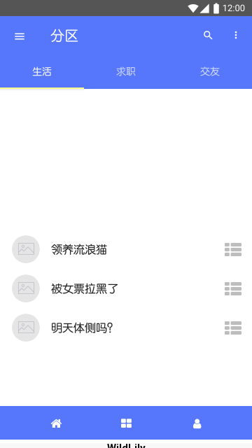
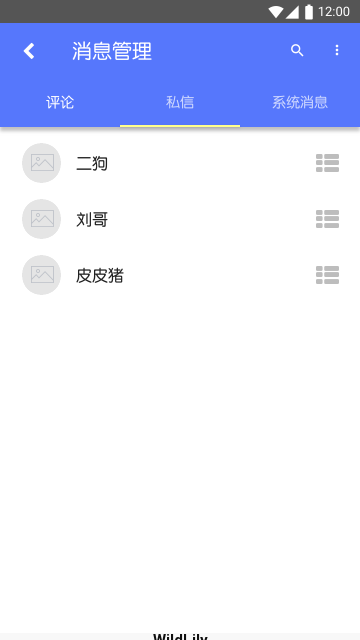
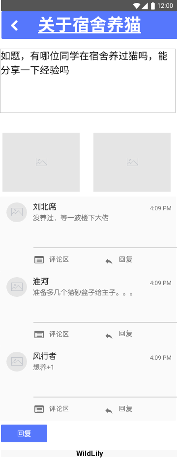

# WildLilyBBS需求规格说明文档

## 目录

[TOC]

## 更新记录

| 日期      | 更新者 | 版本号 | 更新内容 |
| --------- | ------ | ------ | -------- |
| 2018.11.8 | 乔鑫   | 0.0.1  | 基本框架 |
|           |        |        |          |

## 1.引言

### 1.1 目的

本文档是对WildLilyBBS的需求规格说明，本文档将供用户方和系统开发团队使用。

### 1.2 范围

对于校内师生来说，该BBS交流平台可以让使用者快捷、高效、方便地获取和发布信息，方便交流，不再有无法及时查看消息或消息过多无法查找需要信息的情况，极高地提升了校园生活质量。

### 1.3 参考文献

需求工程:软件建模与分析，骆斌、丁二玉，高等教育出版社，2009-04-01，ISBN：9787040262957

## 2.总体描述

### 2.1 商品前景

#### 2.1.1 应用背景

南京大学小百合BBS是南京大学师生最常使用的一个半官方性质的BBS，始建于1997年，经历过关停和复用，现在已经有上亿次的访问记录。但在投入使用以来，小百合BBS的使用上存在着不方便的情况，也没有得到很好的解决。如发帖人和回帖人不能得到较为方便的交流方式，由于网站UI管理问题，虽然BBS有私信功能，但发帖人和回帖人不能较为方便及时地和对方进行交流；小百合BBS也推出过手机app，但由于不是官方管理和维护，无法达到其他交流平台的实时沟通功能。

同时兴起的一个用于校内交流互动的方式是QQ空间衍生出的表白墙，是一个功能性的可管理的由学生投稿及时发布的小程序，表白墙由专人管理账户，统一接收由所有学生私信的投稿，并在收到后进行截图或文字转述发布到账户所在的空间，供所有关注的学生查看，但由于发送投稿过多，发送的信息无法通过分类发送，只有一个简单的时间线来查看历史信息，虽然有了以QQ整个大背景下实现的实时沟通交流，但一旦错过了某条与自己相关、或是感兴趣的信息，就需要花费极大的精力来找到投稿人的相关信息。

结合两种校园较为正规官方的信息交流平台，结合两个平台分别存在的问题和两个平台持有的优势，同时发现最近的软件都提出了每个用户拥有相同APP却又有着不同的用户体验这一理念，决定设计一个能够提高获取信息效率同时也可以实现实时交互的软件，方便信息发布者和信息获取者的使用和体验，从而提高学生生活的质量。

#### 2.1.2 业务机遇

学生通过这一校内社交化交流平台，能保证每个使用者都在首页看到自己兴趣相关的内容，更方便地进行交流讨论，通过设置站内私信系统让有急迫需要的同学（如失物招领等）能够及时地进行联系。设置分类分板块，让使用者能够很方便地找到自己需要参与的信息板块，实现校内信息地高效流通。

#### 2.1.3 业务需求

- BR1:系统投入运营3个月后，个性化首页的推荐转化率达3%

- BR2: 系统投入运营3个月后，除各院系自有的分区外，其他分区共不超过15个

- BR3: 系统投入运营3个月后，各分区首页移动端转化率达5%

- BR4: 系统投入运营3个月后，活跃用户数较小百合上升10%

- BR5: 系统投入运营3个月后，用户在线时长较小百合上升10%

- BR6: 系统投入运营3个月后，全站浏览量较小百合和表白墙的均值上升5%

### 2.2 假设和依赖

- AS-1：在现阶段，校内人数不会有太大变化。
- AS-2：用户有可以连接 Internet 的网络和相关知识。
- AS-3：用户的数量规模有一个最大上限，最大信息存储空间一定。
- AS-4：大部分用户在本意上还是愿意帮助提供反馈。
- DE-1：发帖相关内容需遵守有关法律。

## 3.详细需求描述

### 3.1 对外接口需求

#### 3.1.1 用户界面

##### web端

UI1：用户首页：

首页中的左端可分别进入各个板块，有子版块的可展开后进入子版块主页，首页中间部分为个性化推荐帖子和近期热门帖子的显示，搜索栏可输入关键字查找相关帖子，右侧上部分为登入用户的简单显示，可通过通知、消息、问答分别进入即时交流功能。下方的标签为近期热门关键字，点击标签可直接对标签进行搜索显示相关帖子。

UI2：板块内部：

板块内部构造与首页相同，搜索可在板块内进行，可以按时间或点击、评论等进行帖子的排序，上方的搜索旁可点击发帖按钮进行发帖，右侧标签为板块内热门关键字。

UI3：发帖

点击发帖按钮进入发帖界面，输入标题，可在详细描述中插入图片和表情，点击发布即可发布帖子，取消则回到板块界面。

UI4：查看帖子

点击某一帖子后可进入帖子内部，第一排为发帖人发布信息，不会随着滑动消失，可点击回复按钮进行回帖，在每一排可点击回复按钮进行对这一层的回复，点击右侧xx条回复可展开本层所有回复，可对所有回帖进行排序显示。

UI5：回帖：

点击回复按钮后进入回帖界面，可插入图片或表情，点击发布即可发布回复，点击取消则回到查看帖子界面。

UI6：查看资料

可点击ID或头像（包括自己）进行对用户资料的查看，会显示其发帖历史及该帖子简要信息，右侧发送私信按钮可进入即时对话功能进行对话。

UI7：子版块

对于有子版块的板块，点击左侧后会展开所有子版块，同时主界面会显示所有子版块的大按钮，可通过主界面点击或左侧导航进入子版块。

UI8：消息

点击消息按钮或点击发送私信按钮可进入私信消息界面，左侧为近期私信对象的头像和ID，右侧为聊天板块，可发送消息，通知和问答与消息类似。

UI9：管理员界面

与用户首页没有太大差别，上方具有管理员独有的用户管理和板块管理按钮，可对所有违规帖子进行删除，用户只可删除自己发布的帖子或回复。

UI10：用户管理

点击上方用户管理可进入用户管理功能，主界面显示用户，可通过ID或关键字进行搜索。

UI11：用户详细资料

点击用户后进入用户详细资料，与用户功能类似，在右侧多出封禁用户与删除用户功能，可供管理员进行用户的删除和封禁管理。

UI12：板块管理

点击上方板块管理界面后可进入板块管理，主界面上方为新建板块功能按钮，下方为所有板块的显示，可点击板块名称下第一个图标进行板块信息修改，或点击第二个图标进行板块的删除，若有子版块可点击板块名称进入全部子版块显示。删除板块会直接删除其下子版块。

UI13：新建板块

点击新建板块按钮进入，可输入板块名和板块简介，点击确认按钮则新建板块，点击取消回到上个板块管理界面。修改板块与该界面类似。

##### 移动端

主页左侧最上方是搜索栏，可以根据用户输入的关键词搜索相关的帖子，往下是热门帖子的图片轮播，以及根据用户浏览记录智能推荐的帖子，点击帖子右侧的快捷键可以将特定的帖子设置为不感兴趣，下次推荐将会减少类似帖子的推荐，底部是导航栏，点击中间的图标前往专栏页面，右侧图标去往用户界面

专栏界面最上是导航栏，可以滑动点击选择想要查看的分区，在搜索栏可以搜索该专栏中匹配搜索关键词的帖子，底部同样是导航栏

普通用户选择查看自己的用户界面时，不会显示“发送消息”按钮，右上角可以管理收到的消息，中部是发帖与回帖记录，点击垃圾桶图标可以删除帖子或回复，底部同样是导航栏，若是点击查看别人的用户界面，则只显示“发送消息”而不显示“消息管理”，点击发送消息进入私聊界面，可以与该用户进行聊天

消息管理界面有三栏，分别对应评论，私信，系统消息，可以通过搜索查找与特定用户的私聊或者特定帖子收到的回复

评论栏是用户发帖或者回帖得到的回复，会显示是针对哪一条发帖记录的回复

私信栏可以看到最近私聊过的用户头像和ID，点击ID后进入私聊界面

私聊界面顶部会显示对方ID，中间是聊天记录，下方是输入栏，以及添加图片按钮和发送消息按钮

系统消息界面会显示系统发送给用户的各类消息

管理员的用户界面与普通用户相比多了底部的用户管理和板块管理功能

板块管理界面显示所有的板块，底部有新增，编辑，删除按钮。新增可直接点击，编辑与删除需要选中板块后点击

填写板块名称和板块简介后点击添加按钮添加板块

编辑板块名称和板块简介后点击修改按钮编辑板块

管理员确认板块后点击删除按钮删除板块

中部列出用户，管理员也可通过搜索筛选查找用户，点击用户ID后进入该用户界面

与用户界面类似，底部有删除用户和封禁用户按钮，分别点击并确认可以删除或者封禁用户

点击特定帖子后进入帖子界面，顶部是帖子标题，下方是正文和配图，再往下是用户的回帖，配有用户头像和ID。点击回帖下的评论区可以查看该回帖收到的回复，点击回复按钮进入回复界面并回复该回帖，点击页面底部的回复按钮则进入回复界面并对帖子进行回帖

回帖的回复区有用户对该回帖的评论，配有ID和头像，点击最下方的回复按钮也可以进行回复

管理员的看帖界面，在每个回复以及页面底部添加了“删除图标”，若检测到违规信息，可以点击按钮进行删除

管理员的查看回复区界面，类似于看贴界面，可以删除回复或者整个回帖

回帖界面，填写内容，添加图片后点击发送按钮可以发送回帖

发帖，填写标题正文，添加图片后点击发送按钮可以发布帖子

#### 3.1.2 软件接口

- SI：使用 Redis 和 MySql 作为底层数据库存储各种数据。 

### 3.2 功能描述

#### 3.2.1 个人信息管理

##### 刺激/响应序列

刺激：用户选择个人中心
响应：系统显示用户头像、昵称、个人发帖列表和修改资料按钮
刺激：用户选择修改个人资料
响应：系统显示用户当前头像、昵称、性别、生日、个性签名、入学时间、院校和院系
刺激：用户修改头像、昵称、性别、生日、个性签名、入学时间、院校或院系
响应：系统显示用户修改后的的头像、昵称、性别、生日、个性签名、入学时间、院校和院系
刺激：用户点击个人发帖列表的一项
响应：系统显示该帖子

##### 相关功能需求

| 编号                                            | 需求描述                                                     |
| ----------------------------------------------- | ------------------------------------------------------------ |
| Profile.View Profile.Edit                    | 系统应当显示一个用户的个人资料 系统应当允许用户对个人资料进行修改 |
| Profile.PublishList Profile.PublishList.View | 系统应当显示用户的个人发帖列表 系统应当允许用户通过选择个人发帖列表的一项来查看该帖子 |

#### 3.2.2 看帖

##### 刺激/响应序列

刺激：用户选择个性化主页推荐的帖子 
响应：系统显示帖子详情（包括帖子标题、原帖内容、回帖内容及时间信息） 

刺激：用户选择板块 
响应：系统显示该板块的推荐帖子列表 

刺激：用户选择该板块中列出的某个推荐的帖子 
响应：系统显示帖子详情（包括帖子标题、原帖内容、回帖内容及时间信息） 

刺激：用户输入关键词搜索相关帖子 
响应：系统显示含有搜索词的帖子列表 

刺激：用户选择列出的某个帖子 
响应：系统显示帖子详情（包括帖子标题、原帖内容、回帖内容及时间信息） 

刺激：用户在个人中心选择个人发帖列表 
响应：系统显示用户个人所发布的帖子（包括回帖）列表 

刺激：用户选择某个自己发布的帖子或者某个回帖的原帖 
响应：系统显示帖子详情（包括帖子标题、原帖内容、回帖内容及时间信息） 

刺激：用户选择原帖发布者或某个回帖发布者 
响应：系统显示该发布者所发布的帖子列表 

刺激：用户选择该发布者的某个帖子 
响应：系统显示帖子详情（包括帖子标题、原帖内容、回帖内容及时间信息） 

刺激：用户在浏览推荐帖子列表时选择标记对某个帖子不感兴趣 
响应：系统记录用户不感兴趣帖子并从当前推荐列表删除  

##### 相关功能需求

| 编号                                                         | 需求描述                                                     |
| ------------------------------------------------------------ | ------------------------------------------------------------ |
| View.HomepageList View.HomepageList.NotInterested         | 系统应当在用户的首页提供个性化的推荐帖子的列表 系统应当允许用户选择对推荐的某个帖子不感兴趣 |
| View.Block View.Block.List View.Block.List.NotInterested View.Block.List.Return | 系统应当提供用户个性化板块列表进行选择 系统应当允许用户通过选择某个板块查看该板块的推荐帖子列表 系统应当允许用户选择对推荐的某个帖子不感兴趣 系统应当允许用户返回板块列表重新选择 |
| View.Search                                                  | 系统应当允许用户输入关键词搜索想要查看的帖子                 |
| View.MyList                                                  | 系统应当允许用户在个人中心选择个人发帖列表查看之前发布的帖子或回复的帖子 |
| View.Content View.Content.OtherUser View.Content.OtherUser.Return View.Conten.Return | 系统应当允许用户查看帖子的详情，包括帖子标题、原帖内容、回帖内容及时间等信息 系统应当允许用户选择原帖发布者或某个回帖发布者，查看其发布的帖子列表 系统应当允许用户从该发布者的发帖列表返回 系统应当允许用户返回上一层点击进入该帖子详情的帖子列表 |

#### 3.2.3 发帖

##### 刺激/响应序列

刺激:用户点击发帖按钮进入页面
响应:系统显示文本输入窗口、添加图片按钮和返回按钮

刺激:用户点击返回按钮
响应:系统显示上级页面

刺激:用户填写发帖信息并点击发帖按钮
响应:系统检查是否有违规信息，若没有，发帖并提示用户发帖成功，若有，退回发帖请求

##### 相关功能需求

| 编号              | 需求描述与度量                                               |
| ----------------- | ------------------------------------------------------------ |
| PostPublish.Show  | 用户点击发帖按钮后，系统进入发帖界面，显示空白待填的帖子标题、内容、配图等窗口 |
| PostPublish.Check | 用户点击发布帖子按钮后，检查帖子内容是否有违规情况           |
| PostPublish.Post  | 生成新的帖子对象并发布                                       |
| PostPublish.Back  | 用户点击返回按钮后，系统返回上级界面                         |

#### 3.2.4 回帖

##### 刺激/响应序列

刺激:用户点击选择帖子或回帖后，点击回复按钮进入页面
响应:系统显示文本输入窗口、添加图片按钮和返回按钮

刺激:用户点击返回按钮
响应:系统显示原帖子或回帖

刺激:用户填写回帖信息并点击回复按钮
响应:系统检查是否有违规信息，若没有，回帖并提示用户回复成功，若有，退回回帖请求

##### 相关功能需求

| 编号            | 需求描述与度量                                               |
| --------------- | ------------------------------------------------------------ |
| PostReply.Show  | 用户点击回复按钮后，系统进入回帖界面，显示空白待填的帖子标题、内容、配图等窗口 |
| PostReply.Check | 用户点击回复按钮后，检查回帖内容是否有违规情况               |
| PostReply.Post  | 生成新的回帖对象并发布                                       |
| PostReply.Back  | 用户点击返回按钮后，系统返回上级界面                         |

#### 3.2.5 删帖

##### 刺激/响应序列

刺激：用户在个人中心选择个人发帖列表 
响应：系统显示用户个人所发布的帖子（包括回帖）列表 

刺激：用户选择删除某个帖子或回帖 
响应：系统提示确认 

刺激：用户确认删除 
响应：系统删除该帖子及其所有回帖 

刺激：管理员选择删除某个不合规定的帖子或回帖 
响应：系统提示确认 

刺激：管理员确认删除 
响应：系统删除该帖子及其所有回帖  

##### 相关功能需求

| 编号                                                         | 需求描述                                                     |
| ------------------------------------------------------------ | ------------------------------------------------------------ |
| Delete.MyList Delete.MyList.Confirm Delete.MyList.Cancel | 系统应当允许用户在个人中心选择个人发帖列表删除之前发布的帖子或回复的帖子 系统应当提示用户是否确认删除选择的帖子或回帖 系统应该允许用户取消删除 |
| Delete.Admin Delete.Admin.Confirm Delete.Admin.Cancel  | 系统应当允许管理员删除不符合规定的帖子或回帖 系统应当提示管理员是否确认删除选择的帖子或回帖 系统应该允许管理员取消删除 |

#### 3.2.6 收发消息

##### 刺激/响应序列

刺激：用户选择消息
响应：系统显示评论、私信和通知三个分类

刺激：用户选择评论
响应：系统减少相应的未读评论数目，按时间最近优先显示列表显示该用户评论收到的回复，回帖收到的评论，以及该用户发帖之后收到的回帖 

刺激：用户选择私信
响应：系统按时间最近优先列表显示显示私信概览，包括与该用户私信的用户头像，最近聊天时间和最近的一条消息

刺激：用户点击一条私信概览
响应：系统减少相应的未读私信数目，显示与该用户的私信窗口，包括头像、昵称、最近1天的最近20条聊天记录、文本输入窗口、图片发送按钮和返回按钮

刺激：用户输入文字或选择发送的图片并且点击发送 
响应：系统在聊天窗口中追加最近发的消息

刺激：用户点击返回按钮
响应：系统返回私信概览

刺激：用户选择系统消息
响应：系统按时间优先显示系统消息列表

刺激：用户点击一条系统消息
响应：系统减少相应的系统消息数目，并展示该系统消息

刺激：系统发现用户有未读消息
响应：系统在相应分类上以红色气泡标注未读消息的数目

##### 相关功能需求

| 编号                                                         | 需求描述                                                     |
| ------------------------------------------------------------ | ------------------------------------------------------------ |
| Message.Categories Message.Categories.Default             | 系统应当允许用户选择消息分类 系统默认选择评论分类         |
| Message.Comments Message.Comments.List PostReply.Show  | 系统应当允许用户选择评论分类 系统减少相应的未读评论数目，按时间最近优先显示列表显示该用户评论收到的回复，回帖收到的评论，以及该用户发帖之后收到的回帖 用户点击回复评论或回复回帖 |
| Message.Chat Message.Chat.List Message.Chat.List.Detail Message.Chat.List.Detail.Window Message.Chat.List.Detail.Input Message.Chat.List.Detail.Add Message.Chat.List.Detail.Return | 系统应当允许用户选择私信分类 系统按时间最近优先列表显示显示私信概览，包括与该用户私信的用户头像，最近聊天时间和最近的一条消息 系统允许用户点击一条私信概览，减少相应的未读私信数目，显示与该用户的私信窗口，包括头像、昵称、最近1天的最近20条聊天记录、文本输入窗口、图片发送按钮和返回按钮 系统应该允许用户输入文字或选择发送的图片并且点击发送 系统要在聊天窗口中追加最近发的消息 用户点击返回按钮返回私信概览 |
| Message.System Message.System.List Message.System.List.Detail Message.System.List.Detail.View  | 系统应当允许用户选择系统消息分类 系统要按时间优先显示系统消息列表 系统要让用户点击一条系统消息 系统减少相应的系统消息数目，并展示该系统消息 |
| Message.Unread                                               | 系统发现用户有未读消息，在相应分类上以红色气泡标注未读消息的数目 |

#### 3.2.7 用户管理

##### 刺激/响应序列 

刺激：管理员选择用户管理模块
响应：系统显示所有用户列表 

刺激：管理员按关键字或ID查询用户
响应：系统返回相关用户列表 

刺激：管理员选择一名用户 
响应：系统显示用户详细信息 

刺激：管理员点击删除用户
响应：系统询问是否确认删除 

刺激：管理员选择确认删除 
响应：系统删除用户并返回所有用户列表 

刺激：管理员取消删除 
响应：系统返回用户详细信息 

刺激：管理员点击封禁用户
响应：系统确认封禁时间 

刺激：管理员确认封禁时间并确认封禁 
响应：系统封禁用户并返回所有用户列表 

刺激：管理员取消封禁 
响应：系统返回用户详细信息

##### 相关功能需求

| 编号                   | 需求描述与度量           |
| ---------------------- | ------------------------ |
| UserManager.FindByKeys | 管理员根据关键字查找用户 |
| UserManager.FindByID   | 管理员根据ID查找用户     |
| UserManager.Show       | 系统显示用户详细信息     |
| UserManager.Delete     | 管理员可删除用户         |
| UserManager.Closure    | 管理员可以封禁用户       |

#### 3.2.8 板块管理

##### 刺激/响应序列 

刺激：管理员选择板块管理模块
响应：系统显示所有板块 

刺激：管理员选择新增板块
响应：系统返回空白板块表单 

刺激：管理员填写板块信息
响应：系统确认填写内容并确认返回成功与否

刺激：管理员取消填写信息
响应：系统返回板块列表

刺激：管理员点击删除板块
响应：系统询问是否确认删除 

刺激：管理员选择确认删除 
响应：系统删除板块并返回所有板块列表 

刺激：管理员取消删除 
响应：系统返回板块列表 

刺激：管理员点击修改板块信息
响应：系统显示板块详细信息

刺激：管理员修改信息并确认
响应：系统确认修改内容并返回成功与否

刺激：管理员取消修改 
响应：系统返回板块列表

##### 相关功能需求

| 编号                  | 需求描述与度量                     |
| --------------------- | ---------------------------------- |
| SectionManager.Create | 管理员可以创建新的板块             |
| SectionManager.Show   | 管理员可以查看板块具体信息         |
| SectionManager.Check  | 管理员填写板块信息时，系统检查内容 |
| SectionManager.Modify | 管理员能够修改板块信息             |
| SectionManager.Delete | 管理员能够删除板块                 |

### 3.3 性能需求

| 需求ID | 需求描述                                                     |
| ------ | ------------------------------------------------------------ |
| PR1    | 点击进入帖子后应在1s内完全显示内容                           |
| PR2    | 对发送内容编辑完全后点击发帖键，应在5s内将帖子上传到平台上   |
| PR3    | 对他人的回帖或评论在编辑完成后点击发送，应在3s内显示并在发送5s内通知被评论或回复用户 |
| PR4    | 点击删除确认后应在1s内将内容删除                             |
| PR5    | 消息发送后应在1s内通知对方接收消息                           |
| PR6    | 对用户的管理操作在确认后应在1s内完成                         |

### 3.4 约束

- C1 使用Redis和Mysql数据库

- C2 管理员决定板块分类情况

- C3 良好的人机交互界面

- C4 使用Netty框架

### 3.5质量需求

| 需求ID | 需求描述                                                     |
| ------ | ------------------------------------------------------------ |
| QR1    | 系统对用户信息编辑有规定，用户ID有长度限制                   |
| QR2    | 系统对关键字搜索至少80%与关键字语义匹配，搜索结果包含实际匹配内容的90% |
| QR3    | 使用发帖功能必须通过身份验证                                 |
| QR4    | 在进行编辑帖子、发帖等操作时，如果网络出现故障，系统不能出现故障 |
| QR5    | 使用回帖功能必须通过身份验证                                 |
| QR6    | 帖子需要一定的备份存储，需要有一定的备份故障后恢复能力       |
| QR7    | 删除其他用户的帖子必须经过管理员身份验证                     |
| QR8    | 删除其他用户或封禁用户必须经过管理员身份验证                 |
